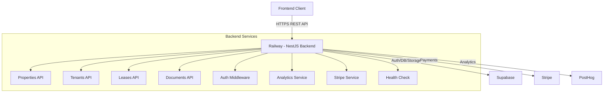
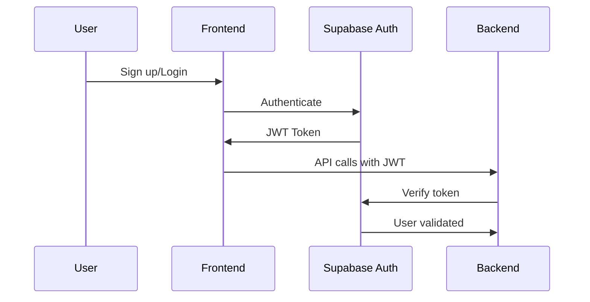
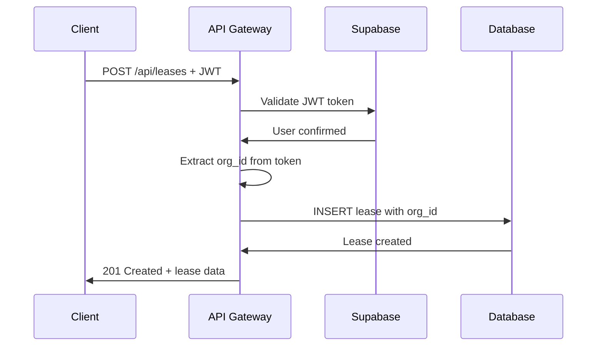
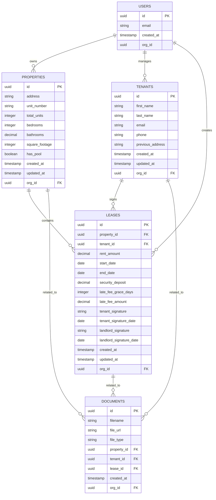

# TenantFlow Backend API - Product Requirements Document (PRD)

## Executive Summary

**Product**: Backend API for property management platform  
**Purpose**: RESTful API serving property, tenant, and lease data  
**Core Value**: Simple, secure, scalable backend supporting property management operations  
**Integration**: Supabase (auth/db), Stripe (billing), PostHog (analytics)

---

## 1. Product Overview

### 1.1 Vision

A simple, beautiful property management dashboard that makes it easy for property owners and managers to store and manage their rental portfolio data without overwhelming complexity.

### 1.2 Core Principles

- **KISS** (Keep It Simple, Stupid)
- **YAGNI** (You Aren't Gonna Need It)
- **DRY** (Don't Repeat Yourself)
- **Single Responsibility Principle**
- **Explicit over Implicit**

### 1.3 Success Metrics

- User signups
- Paid subscription conversions
- Low bounce rate
- Positive A/B testing results

---

## 2. System Architecture



### 2.1 Technology Stack

| Component          | Technology          | Purpose                  |
| ------------------ | ------------------- | ------------------------ |
| **API Framework**  | NestJS 11 + Fastify | REST API server          |
| **Database**       | Supabase PostgreSQL | Data storage             |
| **Authentication** | Supabase Auth       | JWT token validation     |
| **File Storage**   | Supabase Storage    | Document/receipt storage |
| **Payments**       | Stripe API          | Subscription management  |
| **Analytics**      | PostHog API         | Event tracking           |
| **Hosting**        | Railway             | Container deployment     |
| **Language**       | TypeScript          | Type safety              |

---

## 3. Core Features & Requirements

### 3.1 Authentication & User Management

**Provider**: Supabase Auth  
**Methods**: Email/Password + Google OAuth  
**User Role**: All users default to Admin (no role complexity for MVP)



### 3.2 Core CRUD Operations

#### 3.2.1 Properties

**Purpose**: Store property portfolio data  
**Lifecycle**: Permanent (lifetime of ownership)

| Field            | Type      | Required | Description                               |
| ---------------- | --------- | -------- | ----------------------------------------- |
| `address`        | String    | Yes      | Full property address                     |
| `unit_number`    | String    | No       | Unit identifier for multi-unit properties |
| `total_units`    | Integer   | Yes      | Number of units (1 for single-family)     |
| `bedrooms`       | Integer   | Yes      | Number of bedrooms                        |
| `bathrooms`      | Decimal   | Yes      | Number of bathrooms                       |
| `square_footage` | Integer   | No       | Total square footage                      |
| `has_pool`       | Boolean   | No       | Pool amenity                              |
| `created_at`     | Timestamp | Auto     | Record creation date                      |
| `updated_at`     | Timestamp | Auto     | Last modification date                    |
| `org_id`         | UUID      | Auto     | Multi-tenant isolation                    |

#### 3.2.2 Tenants

**Purpose**: Store tenant contact information  
**Lifecycle**: Permanent (history preservation)

| Field              | Type      | Required | Description            |
| ------------------ | --------- | -------- | ---------------------- |
| `first_name`       | String    | Yes      | Tenant first name      |
| `last_name`        | String    | Yes      | Tenant last name       |
| `email`            | String    | Yes      | Contact email          |
| `phone`            | String    | Yes      | Contact phone          |
| `previous_address` | String    | No       | Previous residence     |
| `created_at`       | Timestamp | Auto     | Record creation date   |
| `updated_at`       | Timestamp | Auto     | Last modification date |
| `org_id`           | UUID      | Auto     | Multi-tenant isolation |

#### 3.2.3 Leases

**Purpose**: Store lease agreements and terms  
**Lifecycle**: Most frequently updated (1-2 year cycles)

| Field                     | Type      | Required | Description                  |
| ------------------------- | --------- | -------- | ---------------------------- |
| `property_id`             | UUID      | Yes      | Associated property (FK)     |
| `tenant_id`               | UUID      | Yes      | Associated tenant (FK)       |
| `rent_amount`             | Decimal   | Yes      | Monthly rent amount          |
| `start_date`              | Date      | Yes      | Lease start date             |
| `end_date`                | Date      | Yes      | Lease end date               |
| `security_deposit`        | Decimal   | Yes      | Security deposit amount      |
| `late_fee_grace_days`     | Integer   | Yes      | Days before late fee applies |
| `late_fee_amount`         | Decimal   | Yes      | Daily late fee amount        |
| `tenant_signature`        | String    | No       | Tenant signature data        |
| `tenant_signature_date`   | Date      | No       | Date tenant signed           |
| `landlord_signature`      | String    | No       | Landlord signature data      |
| `landlord_signature_date` | Date      | No       | Date landlord signed         |
| `created_at`              | Timestamp | Auto     | Record creation date         |
| `updated_at`              | Timestamp | Auto     | Last modification date       |
| `org_id`                  | UUID      | Auto     | Multi-tenant isolation       |

### 3.3 Document Storage

**Purpose**: Store receipts and property-related documents  
**Storage**: Supabase Storage  
**File Types**: PDF, images, common document formats  
**Organization**: By property/tenant/lease association

---

## 4. API Specification

### 4.1 RESTful Endpoints

**Base URL**: `https://api.tenantflow.app`

#### Properties API

```
GET    /api/properties           # List all properties
POST   /api/properties           # Create new property
GET    /api/properties/:id       # Get specific property
PUT    /api/properties/:id       # Update property
DELETE /api/properties/:id       # Delete property
GET    /api/properties/search    # Search properties (autocomplete)
```

#### Tenants API

```
GET    /api/tenants              # List all tenants
POST   /api/tenants              # Create new tenant
GET    /api/tenants/:id          # Get specific tenant
PUT    /api/tenants/:id          # Update tenant
DELETE /api/tenants/:id          # Delete tenant
GET    /api/tenants/search       # Search tenants (autocomplete)
```

#### Leases API

```
GET    /api/leases               # List all leases
POST   /api/leases               # Create new lease
GET    /api/leases/:id           # Get specific lease
PUT    /api/leases/:id           # Update lease
DELETE /api/leases/:id           # Delete lease
```

#### Documents API

```
POST   /api/documents            # Upload document
GET    /api/documents            # List documents
GET    /api/documents/:id        # Download document
DELETE /api/documents/:id        # Delete document
```

### 4.2 Authentication

**Method**: Bearer token (Supabase JWT)  
**Header**: `Authorization: Bearer <token>`  
**All endpoints require authentication**

---

## 5. User Experience Flow

### 5.1 API Request Flow



### 5.2 Multi-Tenant Security

- **Row Level Security (RLS)** enforced on all queries
- **org_id filtering** automatic on all CRUD operations
- **JWT token validation** on every request
- **No cross-tenant data leakage** possible

---

## 6. Subscription & Billing

### 6.1 Pricing Tiers

| Tier | Name               | Features                           | Target Users            |
| ---- | ------------------ | ---------------------------------- | ----------------------- |
| 1    | **Starter**        | Core CRUD, Basic features          | Small landlords         |
| 2    | **Growth**         | Enhanced features, More storage    | Growing portfolios      |
| 3    | **TenantFlow Max** | Full feature set, Priority support | Large property managers |

**Philosophy**: No artificial property limits that frustrate users  
**Free Trial**: Handled automatically by Stripe

### 6.2 Stripe Integration

- **Customer creation** on signup
- **Subscription management** (create, update, cancel)
- **Webhook handling** for subscription events
- **Payment method updates**

#### 6.2.1 Webhook Best Practices

**HTTP Status Code Standards:**
- **200 OK**: Processing succeeded completely
- **400 Bad Request**: Invalid payload or validation failed
- **401 Unauthorized**: Invalid webhook signature
- **500 Internal Server Error**: Processing failed (triggers Stripe retries)

**Implementation Guidelines:**
- Let validation errors throw appropriate HTTP status codes
- Let processing errors propagate as 500 status codes
- Only return 200 when webhook processing actually succeeds
- Stripe will automatically retry failed webhooks (5xx status codes)
- This enables proper webhook health monitoring and debugging

#### 6.2.2 Technical Implementation

**NestJS + Fastify Integration:**
- Uses native `@Res() reply: FastifyReply` for direct response control
- Enabled `{ rawBody: true }` in main.ts for webhook signature verification
- Uses `reply.code().send()` instead of NestJS exceptions for proper status codes
- Maintains NestJS architecture while leveraging Fastify's native performance

**JSX Support Configuration:**
- Backend tsconfig.json configured with `"jsx": "react-jsx"`
- Added React types and emails package reference for shared templates
- Enables direct import of React Email templates from `@repo/emails/*`

**Email Strategy (Hybrid Approach):**
- `invoice.payment_failed`: Logging only (prevents email spam from repeated failures)
- `invoice.payment_succeeded`: Simple HTML email (critical success confirmation)
- `customer.subscription.deleted`: Simple HTML email (important state change)
- `customer.subscription.trial_will_end`: Simple HTML email (actionable notification)

**Error Handling:**
- No error swallowing - all exceptions propagate properly
- Proper Stripe customer validation with type guards
- Comprehensive logging for debugging and monitoring

---

## 7. Analytics & Monitoring

### 7.1 PostHog Events

| Event                  | Trigger               | Purpose                |
| ---------------------- | --------------------- | ---------------------- |
| `user_signup`          | Registration complete | Track acquisition      |
| `subscription_created` | Paid plan activated   | Track conversions      |
| `property_created`     | New property added    | Track engagement       |
| `lease_created`        | New lease added       | Track core usage       |
| `document_uploaded`    | File uploaded         | Track feature adoption |

### 7.2 Metrics Dashboard

- **Heatmaps**: User interaction patterns
- **Bounce Rate**: Page abandonment tracking
- **A/B Testing**: Feature/UI optimization
- **Conversion Funnel**: Signup → Paid subscriber

---

## 8. Technical Implementation

### 8.1 Database Schema (Supabase)



### 8.2 Row Level Security (RLS)

**Policy**: All data filtered by `org_id` to ensure multi-tenant isolation  
**Implementation**: Automatic filtering on all CRUD operations  
**Security**: Users can only access their organization's data

### 8.3 File Structure (Current State)

```
src/
├── app.module.ts              # Main application module
├── main.ts                    # Application entry point
├── analytics.service.ts       # PostHog integration
├── stripe.service.ts          # Stripe payment processing
├── auth/                      # Supabase authentication
├── properties/                # Properties CRUD module
├── tenants/                   # Tenants CRUD module
├── leases/                    # Leases CRUD module
├── supabase/                  # Database service
├── health/                    # Health check endpoints
└── common/                    # Shared utilities
```

---

## 9. Deployment & Infrastructure

### 9.1 Environments

| Environment     | Frontend | Backend | Database |
| --------------- | -------- | ------- | -------- |
| **Production**  | Vercel   | Railway | Supabase |
| **Development** | Local    | Local   | Supabase |

### 9.2 Environment Variables

```bash
# Supabase
SUPABASE_URL=https://xxx.supabase.co
SUPABASE_ANON_KEY=xxx
SUPABASE_SERVICE_KEY=xxx

# Stripe
STRIPE_SECRET_KEY=sk_xxx
STRIPE_WEBHOOK_SECRET=whsec_xxx
STRIPE_PRICE_ID_STARTER=price_xxx
STRIPE_PRICE_ID_GROWTH=price_xxx
STRIPE_PRICE_ID_MAX=price_xxx

# PostHog
POSTHOG_KEY=phc_xxx

# App
NODE_ENV=production
PORT=3000
```

### 9.3 Health Checks

**Endpoint**: `GET /health`  
**Checks**:

- Database connectivity (Supabase)
- Service status
- API response time

---

## 10. Success Criteria & Milestones

### 10.1 MVP Definition of Done

- ✅ Core CRUD (Properties, Tenants, Leases) functional
- ✅ Supabase authentication working
- ✅ Stripe subscription flow complete
- ✅ Basic PostHog tracking implemented
- ✅ Document upload/storage functional
- ✅ Search/autocomplete for associations
- ✅ Mobile-responsive UI
- ✅ Production deployment stable

### 10.2 Post-MVP Features (Future)

- Advanced reporting and analytics
- Automated lease renewal reminders
- Tenant portal access
- Maintenance request tracking
- Automated rent collection
- Multi-state lease template generation
- Advanced document management

---

## 11. Risk Mitigation

### 11.1 Technical Risks

| Risk                          | Impact | Mitigation                                                 |
| ----------------------------- | ------ | ---------------------------------------------------------- |
| Railway health check failures | High   | Proper service configuration + database connection testing |
| Supabase RLS misconfiguration | High   | Comprehensive testing of multi-tenant isolation            |
| Stripe webhook reliability    | Medium | Retry logic + webhook verification                         |
| File storage limits           | Low    | Monitor usage + implement cleanup policies                 |

### 11.2 API Risks

| Risk                      | Impact | Mitigation                                   |
| ------------------------- | ------ | -------------------------------------------- |
| Rate limiting issues      | Medium | Implement proper throttling + monitoring     |
| Data consistency problems | High   | Database transactions + validation           |
| API versioning conflicts  | Low    | Semantic versioning + backward compatibility |

---

## 12. Conclusion

This PRD defines a **minimum viable but complete** property management platform focused on simplicity and user experience. The architecture follows KISS/YAGNI principles while providing a solid foundation for future growth.

**Key Success Factors**:

1. **Simplicity**: No over-engineering, focus on core needs
2. **User Experience**: Beautiful, intuitive interface
3. **Scalability**: Clean architecture for future feature additions
4. **Data-Driven**: Analytics to guide product decisions
5. **Scope Discipline**: Final product is expected to be exactly this - nothing less, nothing more. No scope creep or feature deviation allowed.

**Timeline**: Already overdue by 3 months, ship ASAP! 🚀

---

_Last Updated: January 2025_  
_Version: 1.0_  
_Status: Implementation Ready_
