# TenantFlow Frontend - Product Requirements Document (PRD)

## Executive Summary

**Product**: Modern SaaS property management dashboard  
**Target Users**: Property owners, landlords, rental property managers  
**Core Value**: Beautiful, easy-to-navigate interface with mobile-first design  
**Aesthetic**: Modern SaaS style (Vercel, Framer, Shadcn, Cal.com, etc.)

---

## 1. Design Philosophy

### 1.1 Brand Identity

**Tagline**: "**Simplify**. Property Management."

- **"Simplify"** - Always displayed with gradient text effect
- **Two-line layout** - "Simplify" on top, "Property Management" below

### 1.2 Design Principles

- **Mobile-first responsive design**
- **Modern SaaS aesthetic** (clean, minimal, sophisticated)
- **Consistent UI patterns** across all sections
- **Intuitive navigation** with minimal cognitive load
- **Accessible design** following WCAG guidelines

### 1.3 Visual References

Inspired by: Vercel, Next.js, Framer, Shadcn UI, Tray.ai, Typeform, Cal.com, Clay, Resend, Clearbit

---

## 2. User Experience Architecture

### 2.1 Navigation Structure

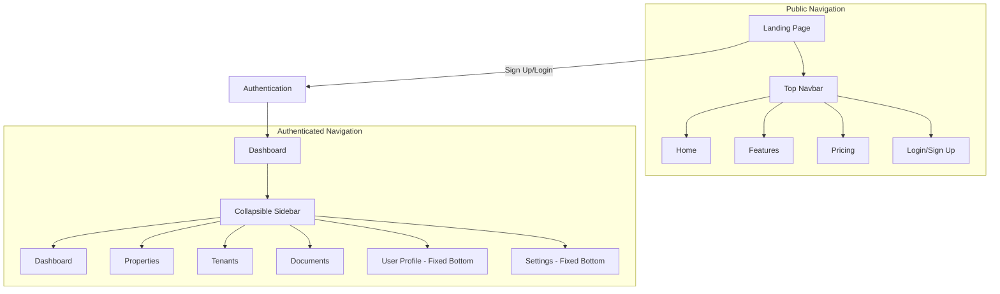

### 2.2 Page Hierarchy

#### Public Pages

- **Landing Page**: Hero section with brand tagline + CTAs
- **Authentication**: Sign up/Login forms with Google OAuth
- **Marketing Pages**: Features, Pricing, etc.

#### Private Dashboard

- **Dashboard**: Overview metrics and widgets
- **Properties**: Property management CRUD
- **Tenants**: Tenant management CRUD
- **Documents**: File upload and management
- **Settings**: User preferences and billing

---

## 3. UI Components & Patterns

### 3.1 Layout Structure

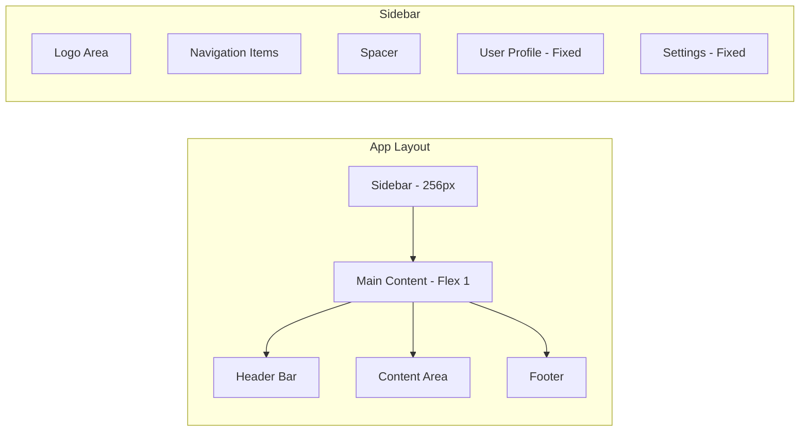

### 3.2 Navigation Components

#### Sidebar Navigation

| Component         | Description                               | Behavior                            |
| ----------------- | ----------------------------------------- | ----------------------------------- |
| **Toggle Button** | Collapse/expand sidebar                   | Shows overlay button when collapsed |
| **Logo Area**     | Brand logo + "TenantFlow"                 | Always visible                      |
| **Nav Items**     | Dashboard, Properties, Tenants, Documents | Active state highlighting           |
| **User Profile**  | Avatar + name                             | Fixed bottom position               |
| **Settings**      | Gear icon                                 | Fixed bottom position               |

#### Top Navbar (Public)

- **Logo** (left)
- **Navigation links** (center)
- **Auth CTAs** (right)
- **Dark/Light toggle** (accessible location)

### 3.3 Data Display Patterns

#### Data Tables

**Consistent pattern across Properties/Tenants/etc.**

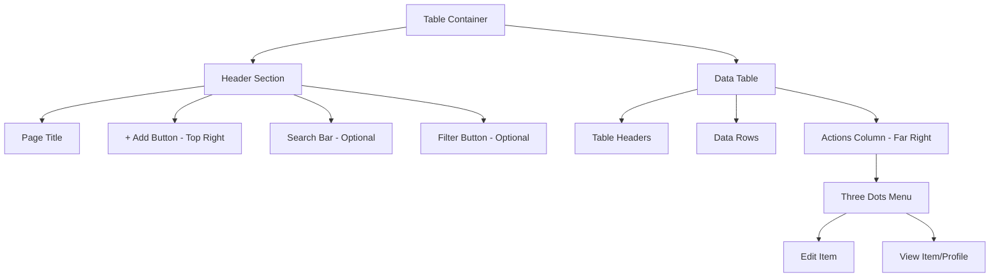

**Table Specifications**:

- **Mobile-responsive**: Stacked cards on mobile
- **Actions menu**: Three dots (•••) dropdown
- **Quick actions**: + Add button always top-right
- **Optional features**: Search, basic filtering, sorting

#### Modal Forms

**All CRUD operations use modal overlays**:

- **Add Property** → Modal form
- **Edit Tenant** → Modal form
- **View Profile** → Modal display
- **Consistent styling** across all modals

---

## 4. Page Specifications

### 4.1 Landing Page (Public)

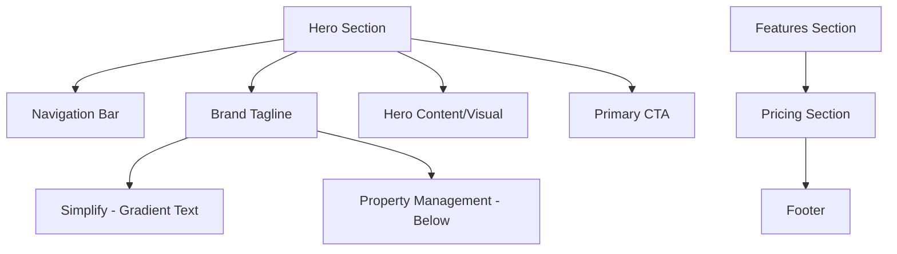

**Hero Section**:

- **Left side**: Brand tagline (Simplify. Property Management.)
- **Right side**: Hero visual (text/graphics, not photo)
- **Large typography** with plenty of whitespace
- **Primary CTA**: "Get Started" or "Sign Up"

### 4.2 Dashboard (Authenticated)

#### Key Metrics Cards

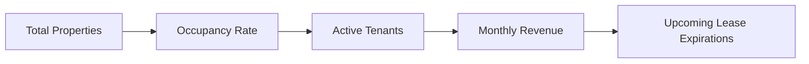

**Dashboard Widgets**:
| Widget | Data Source | Visual Style |
|--------|-------------|--------------|
| **Total Properties** | Properties count | Card with icon |
| **Occupancy Rate** | Occupied/Total ratio | Percentage display |
| **Active Tenants** | Active tenant count | Card with icon |
| **Monthly Revenue** | Current month income | Currency display |
| **Upcoming Expirations** | Leases ending soon | List with dates |

**Color Coding**:

- **Green**: Positive metrics, good performance
- **Orange**: Warning states, attention needed
- **Red**: Critical issues, immediate action

### 4.3 Properties Page

#### Data Table Columns

| Column           | Type     | Description                             |
| ---------------- | -------- | --------------------------------------- |
| **Address**      | Text     | Full property address                   |
| **Type**         | Badge    | apartment/house/condo/commercial/other  |
| **Bedrooms**     | Number   | Number of bedrooms                      |
| **Bathrooms**    | Number   | Number of bathrooms                     |
| **Status**       | Badge    | occupied/vacant/maintenance/unavailable |
| **Current Rent** | Currency | Monthly rent amount                     |
| **Actions**      | Menu     | Edit Property, View Property            |

#### Property Form Schema

```json
{
	"address": "string (required)",
	"type": "select (apartment|house|condo|commercial|other)",
	"bedrooms": "number",
	"bathrooms": "number",
	"square_feet": "number",
	"purchase_price": "currency",
	"current_rent": "currency",
	"status": "select (occupied|vacant|maintenance|unavailable)",
	"description": "textarea",
	"images": "file upload array",
	"amenities": "multi-select array"
}
```

### 4.4 Tenants Page

#### Data Table Columns

| Column        | Type  | Description                       |
| ------------- | ----- | --------------------------------- |
| **Name**      | Text  | Tenant full name                  |
| **Property**  | Link  | Associated property address       |
| **Lease End** | Date  | Lease expiration date             |
| **Status**    | Badge | active/expired/terminated/pending |
| **Contact**   | Text  | Phone number                      |
| **Actions**   | Menu  | Edit Tenant, View Profile         |

#### Tenant Form Schema

```json
{
	"full_name": "string (required)",
	"email": "email (required)",
	"phone": "string",
	"property_id": "searchable select (required)",
	"lease_start": "date (required)",
	"lease_end": "date (required)",
	"rentAmount": "currency (required)",
	"security_deposit": "currency",
	"status": "select (active|expired|terminated|pending)",
	"emergency_contact": {
		"name": "string",
		"phone": "string",
		"relationship": "string"
	},
	"notes": "textarea"
}
```

### 4.5 Documents Page

#### Upload Interface

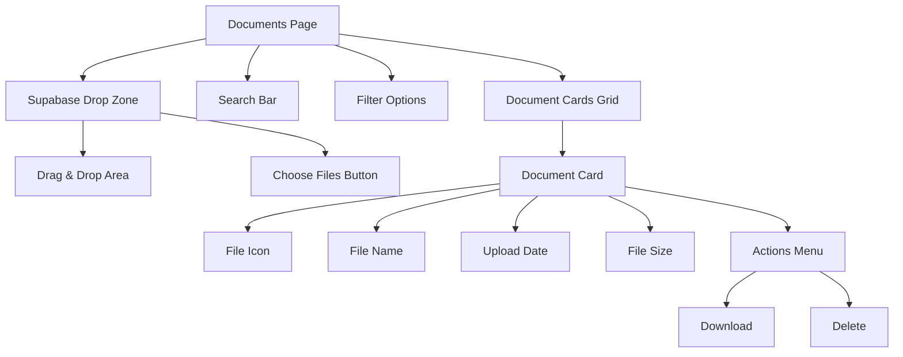

**Document Management**:

- **Upload**: Supabase drop zone component
- **File picker**: Alternative to drag-and-drop
- **Search**: Filter by filename
- **Display**: Card layout with metadata
- **Actions**: Download, delete per document

### 4.6 Financials Page (Future)

#### Metrics Cards

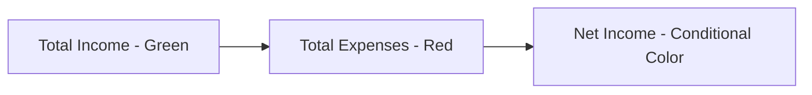

**Color Coding Logic**:

- **Green**: Positive income, healthy net income
- **Orange**: Break-even warning (near zero)
- **Red**: Negative net income (any amount)

#### Transaction Form Schema

```json
{
	"property_id": "searchable select (required)",
	"tenant_id": "searchable select (optional)",
	"type": "select (rent_payment|expense|deposit|late_fee|refund|other)",
	"category": "select (rent|maintenance|utilities|insurance|taxes|management_fees|advertising|legal|other)",
	"amount": "currency (required)",
	"description": "string (required)",
	"date": "date (required)",
	"payment_method": "select (cash|check|bank_transfer|credit_card|other)",
	"reference_number": "string",
	"receipt_url": "file upload",
	"notes": "textarea"
}
```

---

## 5. User Interaction Flows

### 5.1 Property Creation Flow

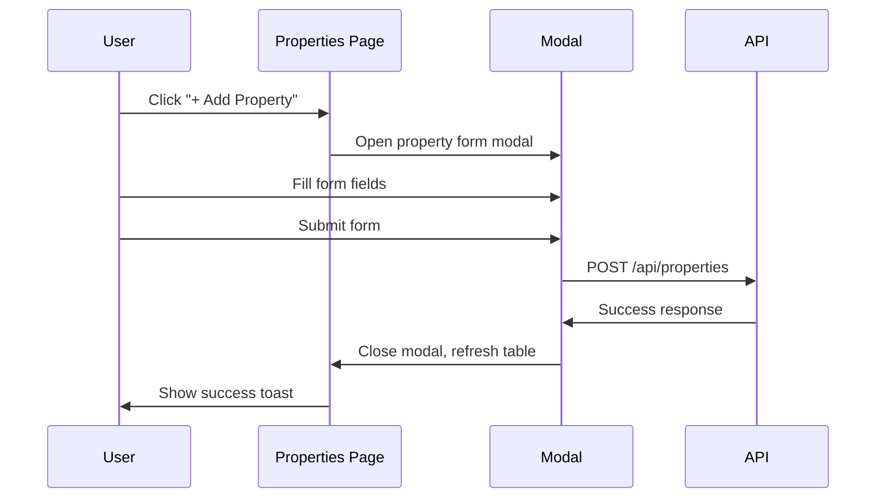

### 5.2 Tenant-Property Association Flow

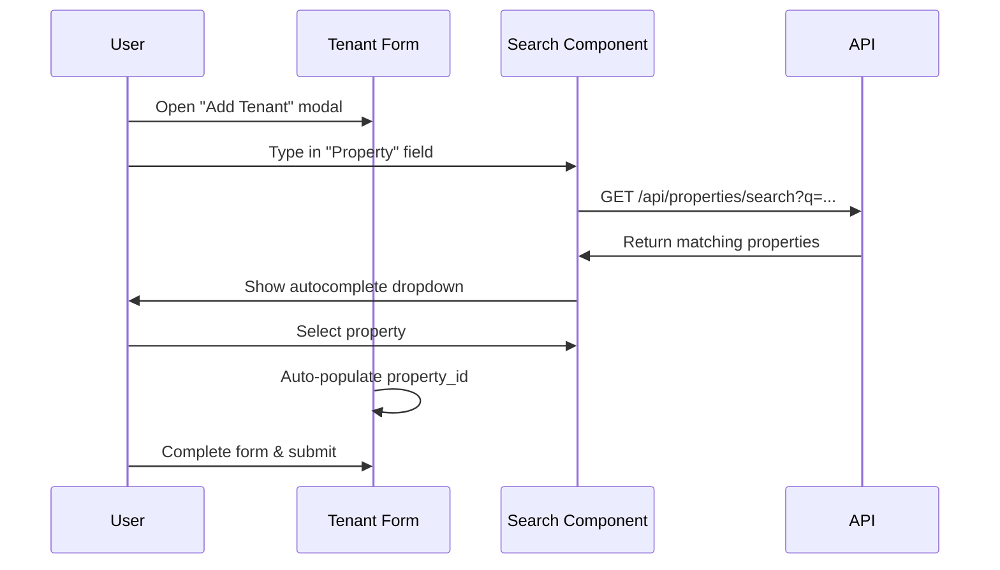

### 5.3 Document Upload Flow

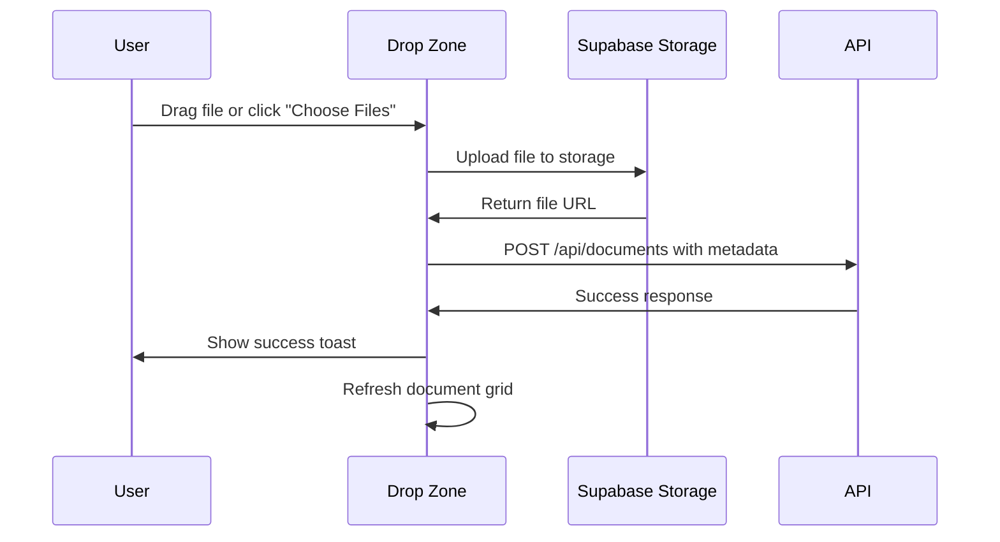

---

## 6. Technical Implementation

### 6.1 Technology Stack

| Component            | Technology               | Purpose              |
| -------------------- | ------------------------ | -------------------- |
| **Framework**        | Next.js 15 + React 19    | Frontend application |
| **Styling**          | Tailwind CSS + Shadcn UI | Component library    |
| **State Management** | Zustand                  | Client state         |
| **Data Fetching**    | TanStack Query           | Server state         |
| **Forms**            | React Hook Form + Zod    | Form validation      |
| **Authentication**   | Supabase Auth            | User management      |
| **File Upload**      | Supabase Storage         | Document handling    |
| **Deployment**       | Vercel                   | Hosting platform     |

### 6.2 Component Architecture

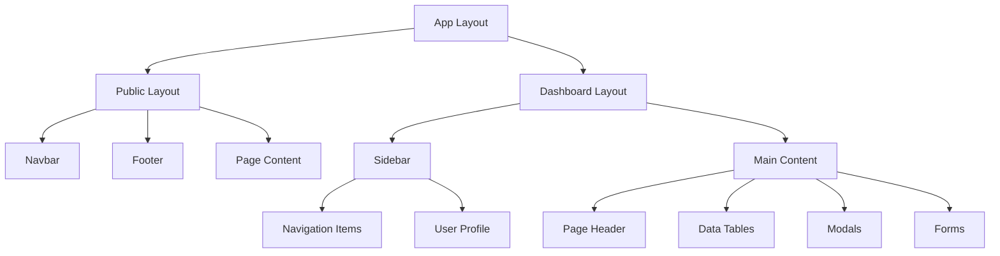

### 6.3 State Management

#### Global State (Zustand)

- **User authentication** state
- **Theme preference** (light/dark)
- **Sidebar collapse** state
- **Modal open/close** state

#### Server State (TanStack Query)

- **Properties** data
- **Tenants** data
- **Documents** data
- **Dashboard metrics**

### 6.4 Responsive Breakpoints

| Breakpoint  | Width          | Behavior                       |
| ----------- | -------------- | ------------------------------ |
| **Mobile**  | < 640px        | Stacked layout, hamburger menu |
| **Tablet**  | 640px - 1024px | Sidebar overlay                |
| **Desktop** | > 1024px       | Fixed sidebar                  |

**Mobile-First Strategy**:

- **Default**: Mobile layout and behavior
- **Progressive enhancement** for larger screens
- **Touch-friendly** interactions
- **Simplified navigation** on small screens

---

## 7. Design System

### 7.1 Color Palette

#### Primary Colors

- **Brand gradient**: Used for "Simplify" text
- **Primary blue**: CTAs and active states
- **Secondary gray**: Text and borders

#### Status Colors

- **Success green**: Positive metrics, success states
- **Warning orange**: Attention needed, break-even
- **Error red**: Critical issues, negative values
- **Info blue**: Informational states

#### Theme Support

- **Light mode**: Default theme
- **Dark mode**: Toggle option (easy to find)
- **System preference**: Respect user's OS setting

### 7.2 Typography

#### Font Hierarchy

- **Headings**: Clean, modern sans-serif
- **Body text**: Readable, accessible sizes
- **Code/Data**: Monospace for numbers
- **Brand text**: Special treatment for "Simplify"

#### Font Sizes (Mobile-First)

```css
/* Mobile sizes */
h1: 2rem (32px)
h2: 1.5rem (24px)
h3: 1.25rem (20px)
body: 1rem (16px)
small: 0.875rem (14px)

/* Desktop sizes */
h1: 3rem (48px)
h2: 2rem (32px)
h3: 1.5rem (24px)
```

### 7.3 Spacing System

**8px Grid System**:

- **xs**: 4px
- **sm**: 8px
- **md**: 16px
- **lg**: 24px
- **xl**: 32px
- **2xl**: 48px

### 7.4 Component Specifications

#### Buttons

- **Primary**: Solid background, high contrast
- **Secondary**: Outline style
- **Ghost**: Minimal style for less important actions
- **Icon buttons**: Square with icon only

#### Form Elements

- **Inputs**: Consistent border radius and padding
- **Labels**: Clear hierarchy and required indicators
- **Validation**: Inline error messages
- **Autocomplete**: Dropdown with search functionality

#### Cards

- **Metric cards**: Dashboard statistics
- **Data cards**: Document and content display
- **Interactive cards**: Hover states and actions

---

## 8. User Experience Features

### 8.1 Error Handling & Feedback

#### Toast Notifications

- **Success**: Green with checkmark icon
- **Error**: Red with warning icon
- **Info**: Blue with info icon
- **Position**: Top-right, auto-dismiss

#### Form Validation

- **Real-time validation**: As user types
- **Inline errors**: Below field with red styling
- **Submit prevention**: Disable until form valid
- **Clear error states**: Visual and accessible

#### Loading States

- **Skeleton screens**: For data loading
- **Button loading**: Spinner in button during submit
- **Page transitions**: Smooth loading indicators

### 8.2 Search & Filtering

#### Property/Tenant Search

- **Autocomplete**: Type-ahead suggestions
- **Fuzzy matching**: Partial matches
- **Result highlighting**: Matched text emphasis
- **Keyboard navigation**: Arrow keys, enter

#### Document Search

- **Filename search**: Full-text search
- **Filter options**: File type, date range
- **Sort options**: Name, date, size

### 8.3 Accessibility Features

#### Keyboard Navigation

- **Tab order**: Logical flow through interface
- **Skip links**: Bypass navigation to content
- **Focus indicators**: Clear visual focus states
- **Keyboard shortcuts**: Common actions

#### Screen Reader Support

- **ARIA labels**: Descriptive labels for actions
- **Landmark regions**: Proper semantic structure
- **Alt text**: Descriptive image alternatives
- **Status announcements**: Form submission feedback

---

## 9. Performance Requirements

### 9.1 Core Web Vitals

| Metric  | Target  | Description              |
| ------- | ------- | ------------------------ |
| **LCP** | < 2.5s  | Largest Contentful Paint |
| **FID** | < 100ms | First Input Delay        |
| **CLS** | < 0.1   | Cumulative Layout Shift  |

### 9.2 Loading Performance

- **Code splitting**: Route-based lazy loading
- **Image optimization**: Next.js Image component
- **Font loading**: Preload critical fonts
- **Bundle analysis**: Monitor build size

### 9.3 Data Loading

- **Optimistic updates**: Immediate UI feedback
- **Caching strategy**: TanStack Query cache
- **Pagination**: For large data sets
- **Infinite scroll**: Where appropriate

---

## 10. Security & Privacy

### 10.1 Authentication Security

- **JWT validation**: All protected routes
- **Token refresh**: Automatic renewal
- **Logout handling**: Clear all client state
- **Route protection**: Redirect unauthorized users

### 10.2 Data Protection

- **Input sanitization**: Prevent XSS attacks
- **CSRF protection**: Form tokens
- **Secure file uploads**: Validate file types
- **Privacy controls**: User data management

---

## 11. Testing Strategy

### 11.1 Component Testing

- **Unit tests**: Individual component logic
- **Integration tests**: Component interactions
- **Visual regression**: Playwright visual testing
- **Accessibility tests**: ARIA compliance

### 11.2 User Experience Testing

- **E2E tests**: Critical user flows
- **Mobile testing**: Device compatibility
- **Performance testing**: Core Web Vitals
- **Cross-browser**: Major browser support

---

## 12. Analytics & Monitoring

### 12.1 User Analytics (PostHog)

| Event               | Trigger       | Purpose          |
| ------------------- | ------------- | ---------------- |
| `page_view`         | Route change  | Track navigation |
| `property_created`  | Form submit   | Feature usage    |
| `tenant_created`    | Form submit   | Feature usage    |
| `document_uploaded` | File upload   | Feature adoption |
| `search_performed`  | Search query  | Search behavior  |
| `modal_opened`      | Modal display | UI interaction   |

### 12.2 Performance Monitoring

- **Core Web Vitals**: Real user monitoring
- **Error tracking**: Unhandled exceptions
- **Bundle analysis**: Build performance
- **User feedback**: In-app feedback forms

---

## 13. Success Metrics

### 13.1 User Experience Goals

- **Time to first interaction** < 3 seconds
- **Task completion rate** > 95%
- **User satisfaction** score > 4.5/5
- **Mobile usability** score > 90%

### 13.2 Business Metrics

- **Signup conversion** from landing page
- **Feature adoption** rates
- **User retention** after 30 days
- **Support ticket** reduction

---

## 14. Future Enhancements

### 14.1 Post-MVP Features

- **Advanced filtering** and sorting
- **Bulk operations** for data management
- **Keyboard shortcuts** for power users
- **Advanced analytics** dashboards
- **Tenant portal** access
- **Mobile app** (React Native)

### 14.2 Internationalization

- **Multi-language** support
- **Currency** localization
- **Date format** localization
- **RTL language** support

---

## 15. Implementation Timeline

### 15.1 Phase 1 - Core MVP (Priority 1)

- ✅ **Landing page** with hero section
- ✅ **Authentication** flow (login/signup)
- ✅ **Dashboard** with key metrics
- ✅ **Properties CRUD** with modal forms
- ✅ **Tenants CRUD** with property association
- ✅ **Basic responsive** design

### 15.2 Phase 2 - Enhanced Features (Priority 2)

- ✅ **Documents** upload and management
- ✅ **Search/autocomplete** functionality
- ✅ **Dark mode** toggle
- ✅ **Advanced form** validation
- ✅ **Performance** optimization

### 15.3 Phase 3 - Polish & Scale (Priority 3)

- ✅ **Advanced filtering**
- ✅ **Bulk operations**
- ✅ **Accessibility** compliance
- ✅ **Mobile optimization**
- ✅ **Analytics** implementation

---

## 16. Conclusion

This frontend PRD defines a **modern, mobile-first property management interface** that prioritizes user experience and follows current SaaS design patterns. The implementation focuses on:

**Key Success Factors**:

1. **Mobile-first responsive design**
2. **Consistent UI patterns** across all features
3. **Modern SaaS aesthetic** with clean, minimal design
4. **Intuitive navigation** with collapsible sidebar
5. **Efficient CRUD operations** via modal forms
6. **Real-time feedback** with toast notifications
7. **Accessible design** following WCAG guidelines
8. **Scope Discipline**: Final product is expected to be exactly this - nothing less, nothing more. No scope creep or feature deviation allowed.

**Design Philosophy**: Beautiful, functional, and easy-to-use interface that makes property management a pleasant experience rather than a chore.

---

_Last Updated: January 2025_  
_Version: 1.0_  
_Status: Implementation Ready_
