# 🚀 TenantFlow Development Roadmap

## Project Timeline Overview

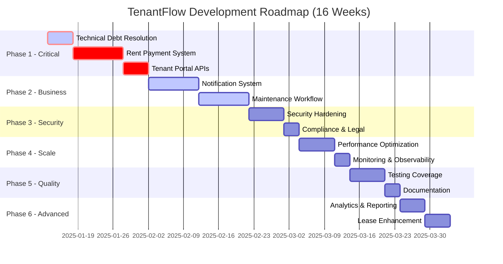

## System Architecture Flow

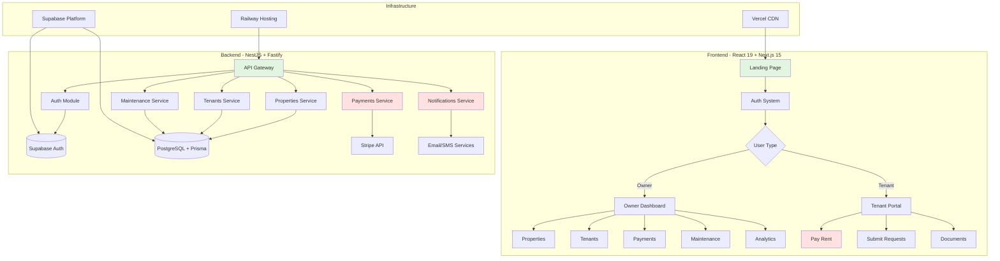

## Development Workflow

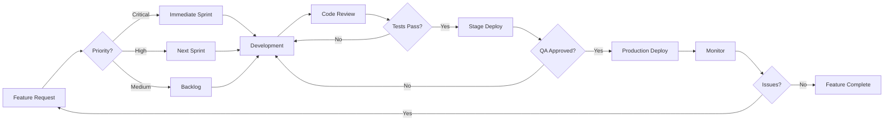

## Priority Matrix

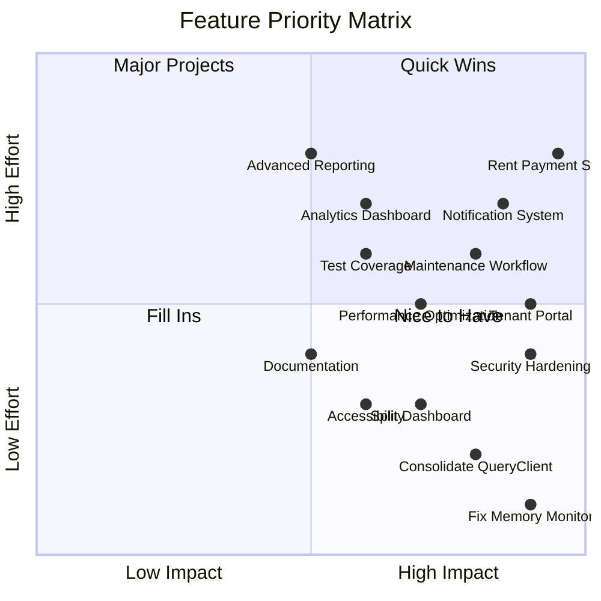

## State Management Architecture

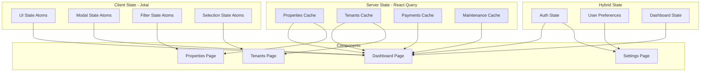

## Database Schema Evolution

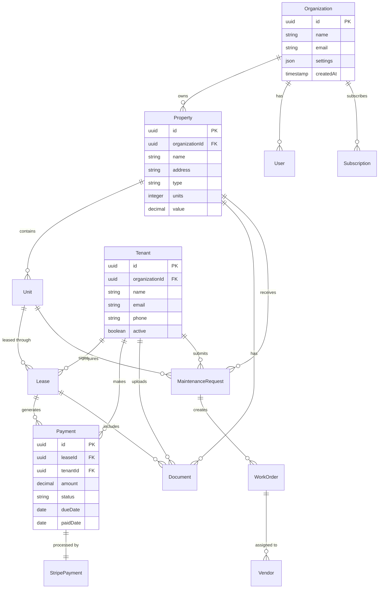

## Component Hierarchy

```mermaid
graph TD
    subgraph "App Router Structure"
        A[layout.tsx] --> B[/(landing)]
        A --> C[/(auth)]
        A --> D[/(dashboard)]
        
        B --> B1[page.tsx - Landing]
        C --> C1[login/page.tsx]
        C --> C2[signup/page.tsx]
        C --> C3[reset/page.tsx]
        
        D --> D1[dashboard/page.tsx]
        D --> D2[properties/page.tsx]
        D --> D3[tenants/page.tsx]
        D --> D4[payments/page.tsx]
        D --> D5[maintenance/page.tsx]
        D --> D6[settings/page.tsx]
    end
    
    subgraph "Component Library"
        E[Button Components]
        F[Form Components]
        G[Layout Components]
        H[Data Display]
        I[Feedback Components]
    end
    
    subgraph "Feature Components"
        J[PropertyCard]
        K[TenantList]
        L[PaymentTable]
        M[MaintenanceQueue]
        N[DashboardStats]
    end
    
    D1 --> N
    D2 --> J
    D3 --> K
    D4 --> L
    D5 --> M
    
    J --> E
    J --> H
    K --> H
    L --> H
    M --> F
    N --> G
```

## Performance Optimization Strategy

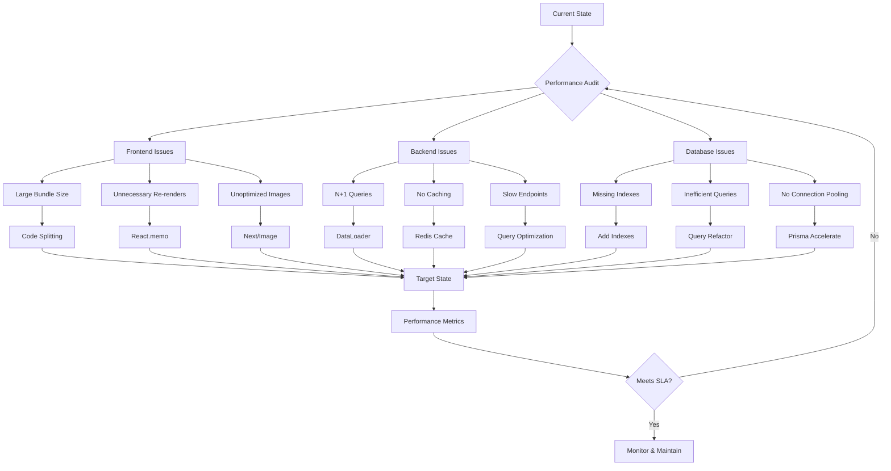

## Testing Strategy

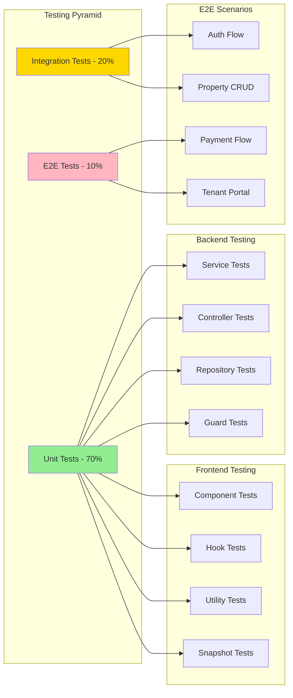

## Deployment Pipeline

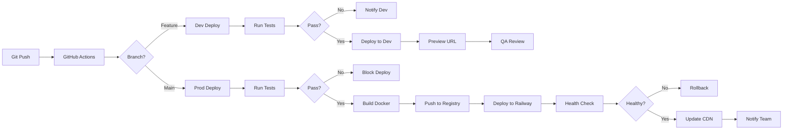

## Issue Priority Flow

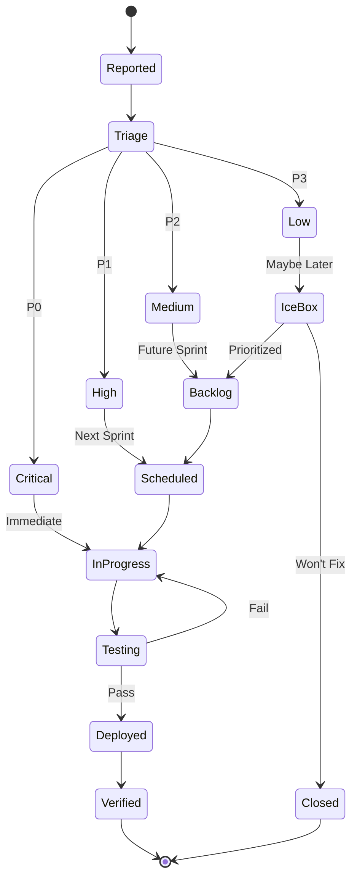

## Success Metrics Dashboard

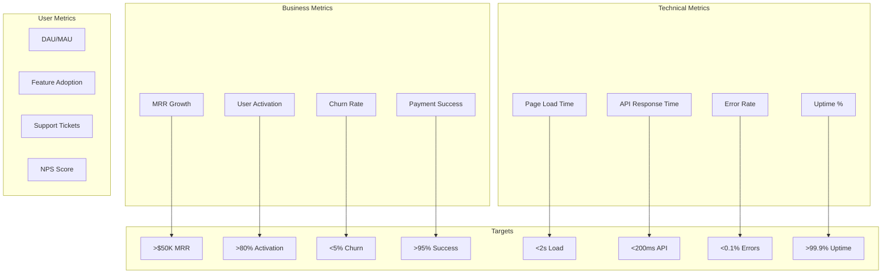

---

## Interactive Roadmap Links

- [View Live Gantt Chart](https://mermaid.live/edit#base64:Z2FudHQKICAgIHRpdGxlIFRlbmFudEZsb3cgRGV2ZWxvcG1lbnQgUm9hZG1hcCAoMTYgV2Vla3MpCiAgICBkYXRlRm9ybWF0ICBZWVZZLU1NLURECiAgICBzZWN0aW9uIFBoYXNlIDEgLSBDcml0aWNhbAogICAgICAgIFRlY2huaWNhbCBEZWJ0IFJlc29sdXRpb24gICAgOmNyaXQsIGFjdGl2ZSwgcDEtMSwgMjAyNS0wMS0xMywgNWQKICAgICAgICBSZW50IFBheW1lbnQgU3lzdGVtICAgICAgICAgOmNyaXQsIHAxLTIsIGFmdGVyIHAxLTEsIDEwZAogICAgICAgIFRlbmFudCBQb3J0YWwgQVBJcyAgICAgICAgICA6Y3JpdCwgcDEtMywgYWZ0ZXIgcDEtMiwgNWQ=)
- [GitHub Issues Dashboard](https://github.com/yourusername/tenant-flow/issues)
- [Project Board](https://github.com/yourusername/tenant-flow/projects/1)

## How to Use This Roadmap

1. **Copy any Mermaid diagram** and paste into:
   - GitHub README (renders automatically)
   - Mermaid Live Editor (https://mermaid.live)
   - VS Code with Mermaid extension
   - Notion, Obsidian, or other Markdown tools

2. **Update the Gantt chart** dates as you progress

3. **Track completion** by checking off items in the priority matrix

4. **Monitor metrics** using the dashboard visualizations

This living document should be updated weekly as the project progresses.